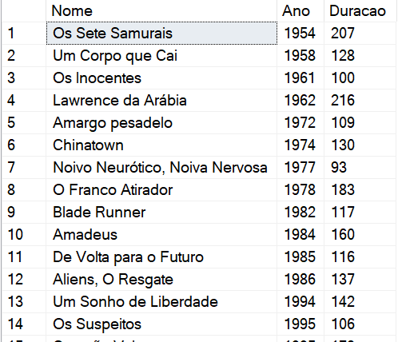
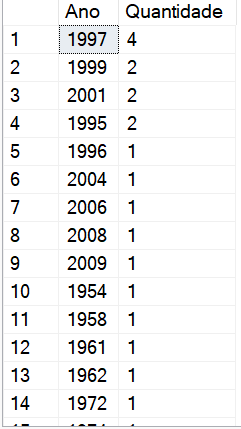
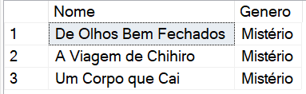

# DIO - Formação .NET Developer - Bancos de Dados Relacionais e Não Relacionais
www.dio.me

## Desafio de projeto Montando Consultas Relacionais no SQL Server
Para este desafio, você precisará usar seus conhecimentos adquiridos no módulo 4-Bancos de Dados Relacionais e Não Relacionais Com SQL Server e MongoDB, da Formação .NET Developer da DIO.

## Contexto
Você é responsável pelo banco de dados de um site de Movies, onde são armazenados dados sobre os Movies e seus atores. Sendo assim, foi solicitado para que você realize uma consulta no banco de dados com o objetivo de trazer alguns dados para análises.

## Proposta
Você precisará realizar 12 consultas ao banco de dados, cada uma retornando um tipo de informação.
O seu banco de dados está modelado da seguinte maneira:

As tabelas sao descritas conforme a seguir:

**Movies**

Tabela responsável por armazenar informações dos Movies.

**Atores**

Tabela responsável por armazenar informações dos atores.

**Generos**

Tabela responsável por armazenar os gêneros dos Movies.

**ElencoMovie**

Tabela responsável por representar um relacionamento do tipo muitos para muitos entre Movies e atores, ou seja, um ator pode trabalhar em muitos Movies, e Movies
podem ter muitos atores.

**MoviesGenero**

Tabela responsável por representar um relacionamento do tipo muitos para muitos entre Movies e gêneros, ou seja, um Movie pode ter mais de um gênero, e um genêro pode fazer parte de muitos Movies.

## Preparando o banco de dados
Você deverá executar o arquivo **ScriptMovies.sql** em seu banco de dados SQL Server, presente na pasta Scripts deste repositório ([ou clique aqui](Script%20Movies.sql)). Esse script irá criar um banco chamado **Movies**, contendo as tabelas e os dados necessários para você realizar este desafio.

## Objetivo
Você deverá criar diversas consultas, com o objetivo de retornar os dados a seguir. Abaixo de cada pedido tem o retorno esperado. O seu retorno deve ser igual ao da imagem.

## 1 - Buscar o nome e ano dos Movies

## 2 - Buscar o nome e ano dos Movies, ordenados por ordem crescente pelo ano

## 3 - Buscar pelo Movie de volta para o futuro, trazendo o nome, ano e a duração

## 4 - Buscar os Movies lançados em 1997

## 5 - Buscar os Movies lançados APÓS o ano 2000

## 6 - Buscar os Movies com a duracao maior que 100 e menor que 150, ordenando pela duracao em ordem crescente

## 7 - Buscar a quantidade de Movies lançadas no ano, agrupando por ano, ordenando pela duracao em ordem decrescente

## 8 - Buscar os Atores do gênero masculino, retornando o PrimeiroNome, UltimoNome

## 9 - Buscar os Atores do gênero feminino, retornando o PrimeiroNome, UltimoNome, e ordenando pelo PrimeiroNome

## 10 - Buscar o nome do Movie e o gênero

## 11 - Buscar o nome do Movie e o gênero do tipo "Mistério"

## 12 - Buscar o nome do Movie e os atores, trazendo o PrimeiroNome, UltimoNome e seu Papel

## Desafio baseado no trabalho de alerrandrojanio

## Roberto Trugilho Moreira Em desenvolvimento...
